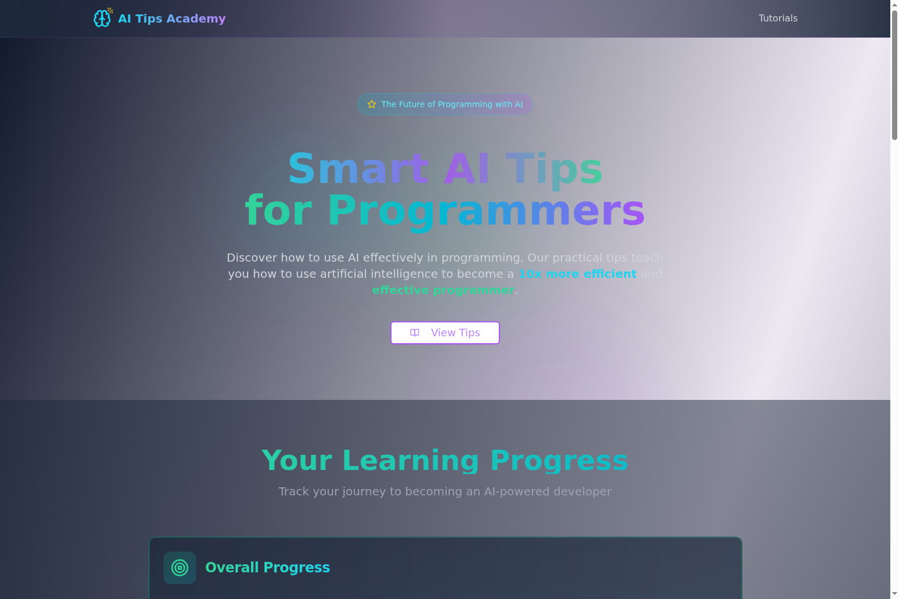

# 🌐 **AI Tips Academy** - Live at [coding-with-ai-tutorial-lqxj.vercel.app](https://coding-with-ai-tutorial-lqxj.vercel.app/)



## 🧠 **Smart AI Tips for Programmers**

**AI Tips Academy** is a cutting-edge educational platform that teaches developers how to leverage artificial intelligence to become **10x more efficient** and **effective programmers**. This interactive web application provides practical, hands-on lessons that transform how you approach coding challenges.

## ✨ **What Makes This Special**

🎯 **Practical Learning Approach** - No theoretical fluff, just real-world techniques you can use immediately  
🔮 **AI-Powered Methodology** - Learn to use AI as your coding companion, not just a search engine  
⚡ **Accelerated Development** - Master programming concepts 10x faster with AI-guided tutorials  
🎨 **Modern Interface** - Beautiful, responsive design with smooth animations and intuitive UX  
📱 **Progress Tracking** - Monitor your learning journey with interactive progress indicators  

## 🎓 **The 6 Essential AI Programming Lessons**

### 1. 🔍 **Solving Error Messages Step by Step**
Learn to systematically debug by copying error codes and asking AI for targeted solutions. Transform frustrating errors into learning opportunities.

**Topics Covered:** Error codes • Debugging strategies • Learning from failures

### 2. 🏗️ **Generate Basic HTML Structure** 
Master rapid web development by letting AI generate foundational HTML structures, giving you a head start on any web project.

**Topics Covered:** HTML structure • Quick start techniques • Web development acceleration

### 3. 📸 **Analyze Screenshots with AI**
Discover how to get targeted help by sharing screenshots of error messages or complex interfaces with AI for precise guidance.

**Topics Covered:** Visual debugging • Screenshot analysis • Contextual problem-solving

### 4. 🧭 **Navigate Complex Tools**
Learn to efficiently navigate sophisticated platforms like Google Cloud Console using AI as your guide through complex interfaces.

**Topics Covered:** Cloud platforms • Navigation strategies • Tool mastery

### 5. ⌨️ **Query Syntax and Commands**
Master the art of getting the right syntax, terminal commands, and code examples from AI when you're stuck.

**Topics Covered:** Syntax assistance • Terminal commands • Code examples

### 6. 🤝 **AI as Learning Partner and Guide**
Transform your workflow by using AI not just as a problem solver, but as a learning partner, guide, and project catalyst.

**Topics Covered:** Workflow optimization • Learning partnership • Efficient development practices

## 🛠️ **Technical Stack**

- **Frontend:** React 18 + TypeScript
- **Styling:** Tailwind CSS + Custom Gradients
- **UI Components:** Radix UI + Custom Components
- **Icons:** Lucide React
- **Build Tool:** Vite
- **Deployment:** Vercel

## 🚀 **Getting Started**

```bash
# Clone the repository
git clone https://github.com/raimonvibe/coding-with-ai-tutorial.git

# Navigate to project directory
cd coding-with-ai-tutorial

# Install dependencies
npm install

# Start development server
npm run dev

# Build for production
npm run build
```

## 🎨 **Features**

- **Interactive Lessons** - Hands-on learning with real code examples
- **Progress Tracking** - Visual progress indicators for completed lessons
- **Responsive Design** - Perfect experience on desktop, tablet, and mobile
- **Modern UI/UX** - Gradient backgrounds, smooth animations, and intuitive navigation
- **Practical Examples** - Real-world scenarios you'll encounter in development

## 🌟 **Why This Matters**

In today's rapidly evolving tech landscape, knowing how to effectively collaborate with AI isn't just an advantage—it's essential. This academy teaches you to:

- **Think strategically** about when and how to use AI assistance
- **Communicate effectively** with AI to get the results you need  
- **Learn faster** by leveraging AI as a teaching assistant
- **Debug smarter** using AI-powered problem-solving techniques
- **Build better** by incorporating AI into your development workflow

## 📝 **License**

This project is licensed under the MIT License - see the [LICENSE](LICENSE) file for details.

## 👨‍💻 **Created By**

**Raimon Baudoin** - [info@raimonvibe.com](mailto:info@raimonvibe.com)

---

*Ready to become a more efficient programmer? Start your AI-powered coding journey today! 🎯*
